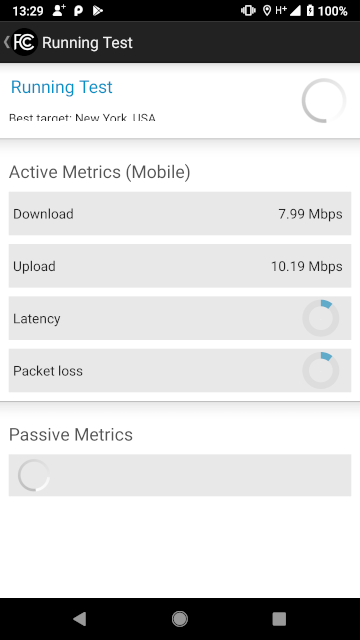

#skandroid-fcc
`modernize` branch

## NOTE
Because this app was never configured to deal with android 'M' (Marshmallow) permissions model, and
all permissions are assumed granted a priori.  This will result in runtime crash the moment
that the "Run" button is pressed.  In order to fix this,
it is *mandatory* that app permissions be manually granted via `Settings -> Apps` system facility

`Figure 1: permissions` *MUST* grant permissions via settings to prevent app from crashing!

##Introduction
This is the GitHub repository that contains the source-code for the SamKnows FCC Speed test app for Android. This repository contains the custom code used in the FCC's version of the app. This code mainly relates to FCC specific UI elements and custom app configuration.

The FCC Android app build is also dependent on the code provided in the skandroid-core GitHub repository for its core functionality.

SamKnows has made this code public in line with its commitment of open data and a transparent technical methodology and in line with the FCC's requirements for making the app code publicly available.

The FCC's speed test app is used to measure mobile broadband performance across the United States of America. More information on this FCC sponsored project can be found at www.fcc.gov/measuring-broadband-america/mobile

The app can be downloaded from the Google Playstore store at https://play.google.com/store/apps/details?id=com.samknows.fcc

You can find more infomation on SamKnows at www.samknows.com

## Modernization
Project was modernized (i.e. converted to work w/recent Android Studio instead of Eclipse)
in Sep 2018

`Figure 2: running metrics` Metrics still work

`Figure 3: twitter` Once the twitter app is installed and logged in on device, tweeting works
