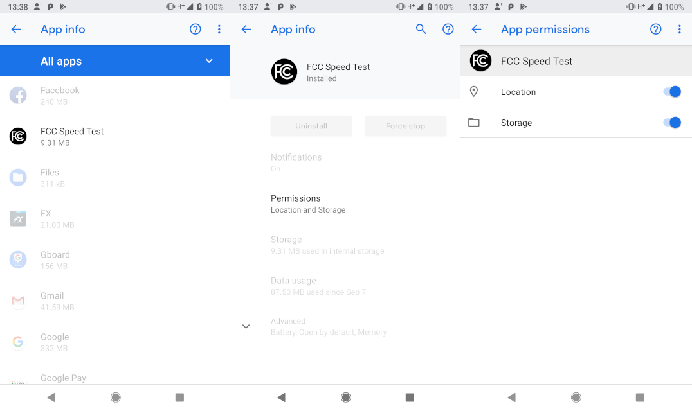
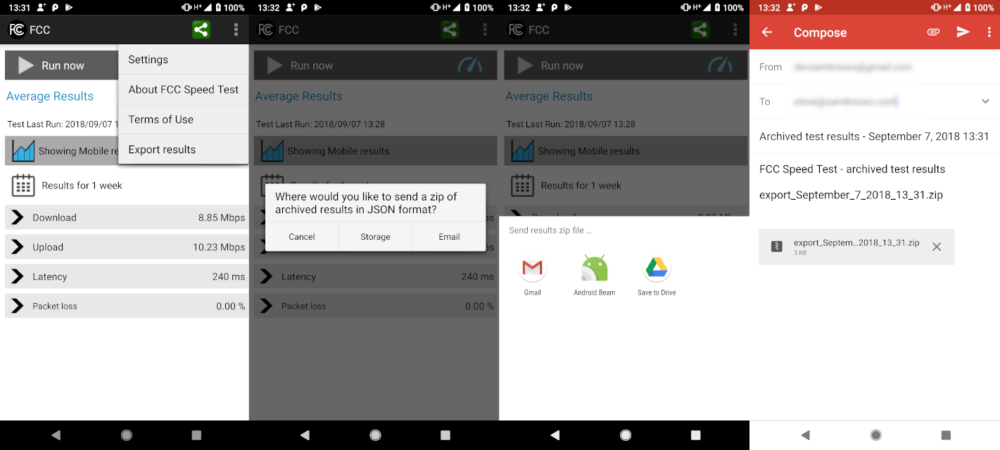

# skandroid-fcc
`modernize` branch

## NOTE
Because this app was created before the android 'M' (Marshmallow) permissions model,
there are no in-app permission requests.   While the code has been updated to at least
deal gracefully with denied permissions, the lack of location and storage permissions will
mean that certain functionality is limited.  So in order to get as close as possible to full
legacy behavior, it will be necessary to manually grant app permissions via `Settings -> Apps` 
system facility as shown below:

 
`Figure 1: permissions` *MUST* grant permissions via settings to enable all functionality

## Introduction
This is the GitHub repository that contains the source-code for the SamKnows FCC Speed test app for Android. This repository contains the custom code used in the FCC's version of the app. This code mainly relates to FCC specific UI elements and custom app configuration.

The FCC Android app build is also dependent on the code provided in the skandroid-core GitHub repository for its core functionality.

SamKnows has made this code public in line with its commitment of open data and a transparent technical methodology and in line with the FCC's requirements for making the app code publicly available.

The FCC's speed test app is used to measure mobile broadband performance across the United States of America. More information on this FCC sponsored project can be found at www.fcc.gov/measuring-broadband-america/mobile

The app can be downloaded from the Google Playstore store at https://play.google.com/store/apps/details?id=com.samknows.fcc

You can find more infomation on SamKnows at www.samknows.com

## Modernization
Project was modernized (i.e. converted to work w/recent Android Studio instead of Eclipse)
in Sep 2018

### Known issues following modernization

#### Facebook integration broken
It appears that posting to facebook no longer works (even with facebook app installed
and logged in on device); this is not unexpected as the facebook SDK bundled with this
app is several years old, and facebook regularly deprecates old SDKs.

### In action
Here's what the rejuvenated app looks like running on a modern device

 
`Figure 2: running metrics` Metrics still work

 
`Figure 3: export metrics json` Metrics export as json via emails still works

 
`Figure 4: twitter` Once the twitter app is installed and logged in on device, tweeting works
